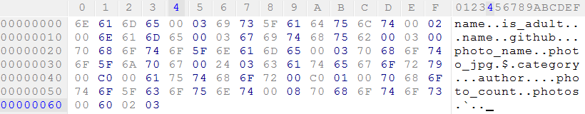
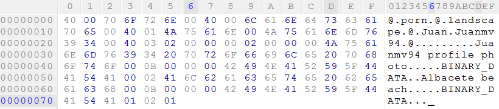

# JData
## About JData
JData is a new and revolutionary data interchange format.

*JSON* and *XML* are some of the most known readable data interchange formats that uses named values.
However, in these data transfers there's no need to transfer the same known value names everytime. This is a waste of data!
JData solves this using a splitted **data structure** that can be used for multiple **data values**.

Data values are transfered in binary form, this means a lot of advantages:

* You don't need to parse integers/floats, they are directly transfered (more speed, less size).
* Arrays are transfered with one value followed by the next without commas or other delimiters (more speed, less size).
* More value types!
 
JData is not only faster and more efficient in data size than others. It also allows you to do many more things.
Lets thing about this JSON data:

    {
      "photo_count": 2,
      "photos": [
        {
          "photo_name": "Juanmv94 profile photo",
          "photo_jpg": binary data (UINT8 array),
          "category": {
            "name": "porn",
            "is_adult": true
          },
          "author": {
            "name": "Juan",
            "github": "Juanmv94"
          }
        },
       {
          "photo_name": "Albacete beach",
          "photo_jpg": binary data (UINT8 array),
          "category": {
            "name": "landscape",
            "is_adult": false
          },
          "author": {
            "name": "Juan",
            "github": "Juanmv94"
          }
        }
      ]
    }

Here we can see that:

* *photos*, *category*, and *author* have always the same structure. Structures defined in the JData **data structure** can be used for multiple instances, so you don't need to define it multiple times.
* *category*, and *author* can be repeated multiple times with the same value. JData allows referenced shared data for repeated values.
* JData allow binary data fields using UINT8 arrays. You don't need to use BASE64 or some other inefficient alternatives.

## JData definition
### Data type
A single byte is used to specify the data type in **data structure**. Special type *whatever* allows variable data types, that must be specified in **data values**.

    MSB 0 0 0 0 0 0 0 0 LSB
	    | | | \_______/
	    | | |  data type value / first 5 most significant bits from structure ID
	    | | Is array of ...? (1=array,0=no array)
	    | 1=Structure ID, 0= data type value
	    Is referenced shared data? (1=yes,0=no)
		
The posible data type values are the following:

| Value | Type     | Length (bytes)| Info                                                                                   |
|-------|----------|---------------|----------------------------------------------------------------------------------------|
| 0     | whatever | ?             | Value type is specified in **data values**                                             |
| 1     | null     | 0             | This type must be used only in **data values** with **data structure** type *whatever* |
| 2     | boolean  | 0 (1 bit)     | Boolean values are packed in the final bytes from **data values**                      |
| 3     | string   | string size+1 | String finished with a 0x00 character                                                  |
| 4     | UINT8    | 1             |                                                                                        |
| 5     | INT8     | 1             |                                                                                        |
| 6     | UINT16   | 2             |                                                                                        |
| 7     | INT16    | 2             |                                                                                        |
| 8     | UINT32   | 4             |                                                                                        |
| 9     | INT32    | 4             |                                                                                        |
| 10    | UINT64   | 8             |                                                                                        |
| 11    | INT64    | 8             |                                                                                        |
| 12    | float    | 4             |                                                                                        |
| 13    | double   | 8             |                                                                                        |

* If data is a structure ID, an aditional char is read to get 13 bits=up to 8192 structures.
* Then, if data is an array, an aditional char is read to get the array size type that will be used in **data values**:

| Value | Type     | Length (bytes)| Info                                                                                   |
|-------|----------|---------------|----------------------------------------------------------------------------------------|
| 0     | none     | 0             | An array that will always be empty. Migth be used with *whatever* data type            |
| 1     | UINT8    | 1             | Up to 255 elements                                                                     |
| 2     | UINT16   | 2             | Up to 65535 elements                                                                   |
| 3     | UINT32   | 4             | Up to 4294967295 elements                                                              |

### Booleans
Boolean values are packed in the final bytes from **data values** after the data from last structure is set.
Boolean bits are read from first byte to last byte, from least significant bit to most significant bit. the values ​​of the unnecesary bits that are in the last byte are not relevant.
The order of assignment of the Boolean bits follows the order of reading of the **data values**.

### Data structure example
The following picture shows the content of the data structure for the previous example:

* We start reading the first structure (ID=0) reading the first value name '*name*' that must be followed by a 0x00 character.
* Now we set the data type as string (data type=3).
* We read the next value name and type for first structure (ID=0) '*is_adult*' with boolean (data type=2).
* When trying to get the next value name, we get a 0x00 character. This means the end of the current structure, so we start reading a new structure (ID=1).
* We do the same until the end of file... Last structure (ID=3) will become the main structure.
  * Notice that '*photos*' data type 0x60,0x02,0x03 means array of structure ID=2 with its size stored on a UINT32 

### Data values example
The following picture shows the content of the data values for the previous example:

* We start reading the shared referenced values (referenced value ID=0). The first byte (2 bytes if structure) set the data type. In our example, the first two bytes set structure ID=0 as data type.
  * Notice that the referenced value bit has no function here.
* the first value from data structure ID=0 was string '*name*'. We read '*porn*' followed by the 0x00 char menaning the end of string.
  * If we had a *whatever* value, we first read a character with the data type, and then we read the data.
* '*is_adult*' is a boolean value. Boolean values are stored at the end of the file, so we set this boolean as boolean ID=0 and we don't need to read anything more. We ended reading the current structure.
* We continue reading for new referenced values and we get another data structure ID=0 with name='*landscape*' (referenced value ID=1) and a structure ID=1 with another two strings (referenced value ID=2).
* When we get another referenced value data type we get structure ID=3 (main structure) this means the end of the referenced values and we start reading the main structure values.
* The first value '*photo_count*' is a UINT32 value. JData uses **little Endian** for integer values.
* Notice that arrays are started with an array size (integer type set in **data structure**) and followed by the values one by one. In our example array size is 2 (UINT32).
* Referenced values are just an integer with the referenced value ID that must match the data type. Integer type depends on the number of referenced value IDs defined. Ex: if we are defining referenced value ID=255 we use UINT8 as integer type, but we start using UINT16 from referenced value ID=256.
* After the last value from the main structure is read, we start reading the boolean bits. In our example we only have 2 booleans for 2 '*is_adult*' values. The first boolean is the least significant bit from this first (and last) byte 1=true, and the second boolean is the second least significant bit 0=false.

### Whatever type limitations
Here are some rules and limitations from the whatever JData type:
* Since whatever data type allows different types, arrays of whatever types are not allowed. However whatever type allows array types like UINT8 arrays, and you can make and array of structures containing a whatever type.
* You can't set a whatever type data value to whatever type. if you do, an infinite loop would occur that would cause a black hole to swallow the entire universe.

## C++ library
I tried to make the C++ library as easy as posible. Just check the example ;)

TODO

* JDD parser is not implemented
* Test on a big endian machine and add compatibility with non char arrays

## Javascript/Java library
Error 404 not found. Try it again in a few decades.

## Visual Basic library
Error -131231567 geek overflow